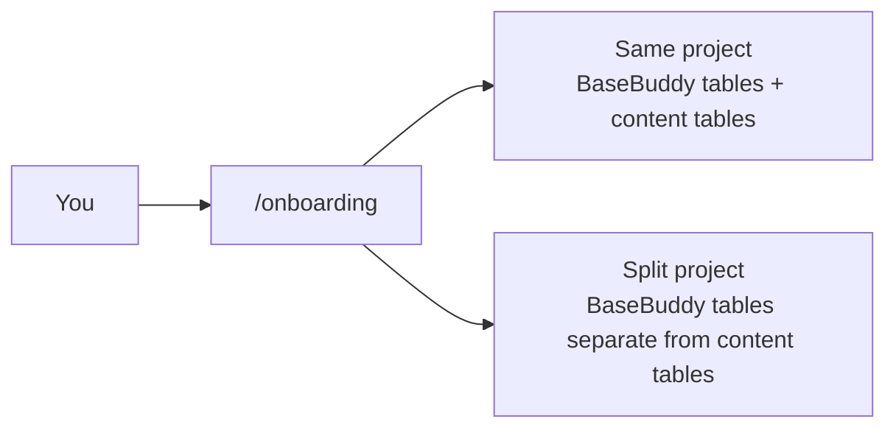

# BaseBuddy Install Guide

This guide walks through a self-hosted BaseBuddy install from a public GitHub repository.

## Prerequisites

- Node.js 22 recommended.
- `pnpm@10.32.1`.
- A Supabase/Postgres project for BaseBuddy setup data.
- A Supabase/Postgres project or database that contains the content tables you want to edit.
- Supabase Auth access for the app URL.
- Optional S3-compatible credentials when mapped media or files use private object storage.

## 1. Clone And Install

```sh
git clone git@github.com:basebuddy-cms/basebuddy.git
cd basebuddy
pnpm install
```

Start the app for first-run setup:

```sh
pnpm dev
```

The dev script runs Next.js on port `8080`.

Open setup:

```text
http://localhost:8080/onboarding
```

BaseBuddy can render onboarding before `.env` exists. Use that page as the primary first-run guide.

For production, build before using `pnpm start`:

```sh
pnpm build
pnpm start
```

## 2. Choose A Topology

BaseBuddy supports two install shapes.



Same-project installs are simplest. Use one Supabase/Postgres project for BaseBuddy setup data and your editable content:

```sh
BASEBUDDY_SUPABASE_URL=
BASEBUDDY_SUPABASE_PUBLISHABLE_KEY=
BASEBUDDY_SUPABASE_SECRET_KEY=
BASEBUDDY_DATABASE_URL=
BASEBUDDY_AUTH_PROVIDERS=password,magic_link,google,github
```

Split-project installs keep BaseBuddy setup data separate from your content database:

```sh
BASEBUDDY_CONTROL_SUPABASE_URL=
BASEBUDDY_CONTROL_SUPABASE_PUBLISHABLE_KEY=
BASEBUDDY_CONTROL_SUPABASE_SECRET_KEY=
BASEBUDDY_CONTROL_DATABASE_URL=

BASEBUDDY_CONTENT_SUPABASE_URL=
BASEBUDDY_CONTENT_SUPABASE_PUBLISHABLE_KEY=
BASEBUDDY_CONTENT_SUPABASE_SECRET_KEY=
BASEBUDDY_CONTENT_DATABASE_URL=

BASEBUDDY_AUTH_PROVIDERS=password,magic_link,google,github
```

Create `.env` in the repo root, paste the block generated by `/onboarding`, replace placeholders with Supabase values, and restart BaseBuddy.

Do not mix same-project env names and split-project env names. BaseBuddy rejects mixed env shapes so it does not accidentally read from or write to the wrong project.

For local Supabase, add `?sslmode=disable` to the database URL. For hosted Supabase, prefer the pooler connection string shown in the dashboard unless your host supports direct IPv6 database connections.

## 3. Apply The Control-Plane Migration

Apply the baseline migration to the Supabase/Postgres project that stores BaseBuddy setup data.

Same-project:

```sh
psql "$BASEBUDDY_DATABASE_URL" -v ON_ERROR_STOP=1 -f supabase/migrations/20260420130000_basebuddy_self_host_baseline.sql
```

Split-project:

```sh
psql "$BASEBUDDY_CONTROL_DATABASE_URL" -v ON_ERROR_STOP=1 -f supabase/migrations/20260420130000_basebuddy_self_host_baseline.sql
```

You can also paste the migration into the Supabase SQL editor.

The migration installs BaseBuddy-owned tables, RPCs, roles, permissions, and a schema readiness marker. BaseBuddy does not apply this SQL automatically.

## 4. Configure Supabase Auth

In the Supabase project that stores BaseBuddy setup data:

1. Enable the Auth providers listed in `BASEBUDDY_AUTH_PROVIDERS`.
2. Set the Supabase Auth Site URL to your deployed app URL.
3. Add redirect URLs:
   - `http://localhost:8080/auth/callback`
   - `<your-production-url>/auth/callback`
   - `https://your-app.vercel.app/auth/callback` when using a temporary Vercel domain
   - `<your-production-url>/invite/*`
4. Confirm email templates send users back to the configured callback URL.

Supported provider values are:

- `password`
- `magic_link`
- `google`
- `github`

If `BASEBUDDY_AUTH_PROVIDERS` is not set, all four are enabled in the UI.

## 5. Configure Storage Credentials

Mapped media and files can use Supabase Storage or S3-compatible storage. Storage credentials are install-level env values. They are not collected inside project mapping screens.

Shared S3-compatible credentials:

```sh
BASEBUDDY_S3_ACCESS_KEY_ID=
BASEBUDDY_S3_SECRET_ACCESS_KEY=
```

Separate media/files credentials:

```sh
BASEBUDDY_MEDIA_S3_ACCESS_KEY_ID=
BASEBUDDY_MEDIA_S3_SECRET_ACCESS_KEY=
BASEBUDDY_FILES_S3_ACCESS_KEY_ID=
BASEBUDDY_FILES_S3_SECRET_ACCESS_KEY=
```

If one key in a credential pair is set, the other must be set too.

## 6. Verify Setup

Open `/onboarding` and run the readiness checks, or use the CLI:

```sh
pnpm setup:check
```

The checker validates env shape, redacts secrets, checks control-plane readiness, detects unified or split topology, checks content-plane connectivity when possible, and reports incomplete storage credential pairs.

When setup is ready:

```sh
pnpm build
pnpm start
```

## 7. Create The First Project

1. Sign in.
2. Open `/projects`.
3. Create a project with a name and slug.
4. Open the project editor.
5. Use auto-detection if it helps, or choose manual mapping.
6. Map posts, authors, categories, tags, workflow fields, media, and files as needed.
7. Save the mapping.

The saved mapping is the runtime source of truth.

## 8. Edit Content

After mapping:

1. Open the mapped Posts collection.
2. Select or create a post.
3. Edit mapped fields.
4. Use `Save` for dirty-field writes.
5. Use `Publish`, `Unpublish`, or `Archive` only when you intend a workflow action.

BaseBuddy does not rename, reshape, or migrate your content tables during normal editing.

## 9. Production Notes

BaseBuddy includes app-level request guards and process-local rate limits. For public internet deployments, place the app behind a host, reverse proxy, or WAF that provides HTTPS, shared rate limits, and request body limits.

Reverse proxy expectations:

- Terminate HTTPS before exposing the app publicly.
- Strip or overwrite client-supplied `x-forwarded-*` headers.
- Forward the public host and protocol correctly.
- Set body-size limits that match your upload policy.

Production responses include HSTS. Confirm HTTPS is working for the final domain before exposing the app to real users.

## Next Steps

- [Configuration](./docs/configuration.md)
- [Onboarding](./docs/onboarding.md)
- [Deployment](./docs/deployment.md)
- [Troubleshooting](./docs/troubleshooting.md)
