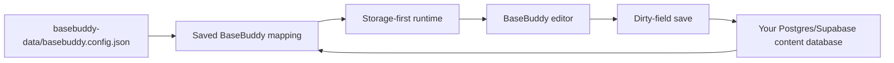

<p align="center">
  
</p>

<h1 align="center">Self-Hosted Editor For Existing Postgres/Supabase Schemas</h1>

<p align="center">
  BaseBuddy maps the tables you already have, then gives your team a clean editor without reshaping your database around a CMS.
</p>

<p align="center">
  <a href="https://basebuddycms.com">Website</a>
  ·
  <a href="https://demo.basebuddycms.com">Demo</a>
  ·
  <a href="./INSTALL.md">Install</a>
  ·
  <a href="https://basebuddycms.com/docs">Docs</a>
  ·
  <a href="https://basebuddycms.com/support">Support</a>
  ·
  <a href="./LICENSE">License</a>
  ·
  <a href="./SECURITY.md">Security</a>
  ·
  <a href="./AGENTS.md">Agents</a>
  ·
  <a href="./CHANGELOG.md">Changelog</a>
  ·
  <a href="https://github.com/basebuddy-cms/basebuddy">GitHub</a>
</p>


## What BaseBuddy Is

BaseBuddy is a self-hosted editor for existing Postgres or Supabase content databases.

You run one BaseBuddy app, create `basebuddy-data/basebuddy.config.json` from `/onboarding` or the CLI, create projects, map existing tables, and start editing. The saved mapping is the runtime source of truth. Your content database stays yours.

BaseBuddy is useful when you want:

- a clean editor for existing posts, pages, docs, guides, or content tables;
- a WordPress-like editing experience backed by your own Postgres/Supabase tables;
- a TipTap editor that can work with Markdown and HTML storage formats;
- media and file management through mapped Supabase Storage or S3-compatible buckets;
- SEO fields, redirects, slugs, authors, categories, tags, and publishing workflows;
- role-based and user-specific permissions;
- an admin UI that respects the shape of your current schema.

## What BaseBuddy Does Not Do

- It does not rename your tables.
- It does not reshape your schema during normal setup or editing.
- It does not store per-project database credentials in project rows.
- It does not silently publish, unpublish, or archive content when you click Save.
- It does not rewrite unchanged fields just because a post was opened.
- It does not coerce Markdown into HTML, HTML into Markdown, arrays into strings, or one storage shape into another on normal save.

`Save` writes dirty fields only. `Publish`, `Unpublish`, and `Archive` are explicit actions.

## How It Works



BaseBuddy separates three ideas:

- **Storage contract**: where a value lives, what shape it has, whether it is editable, and how it should be patched.
- **Semantic role**: optional meaning like title, content, slug, status, author, category, tags, or featured image.
- **UI**: the editor control selected from the storage contract, then refined by semantic role.

`basebuddy-data/basebuddy.config.json` stores BaseBuddy users, sessions, projects, members, permissions, invitations, saved mappings, and sidebar layout. Database URLs, service keys, signing secrets, and storage access keys stay in `.env` or deployment environment variables.

## Quick Start

You need:

- Node.js 22 recommended;
- `pnpm@10.32.1`;
- a Postgres/Supabase database with content you want to edit.

Clone and install:

```sh
git clone git@github.com:basebuddy-cms/basebuddy.git
cd basebuddy
pnpm install
pnpm dev
```

Open:

```text
http://localhost:8080/onboarding
```

Finish the three onboarding screens: connect the database with env values from `.env.example`, create the owner account, and let setup checks run. BaseBuddy writes `process.cwd()/basebuddy-data/basebuddy.config.json`, then you sign in and create your first project.

Agents or operators can use the CLI instead:

```sh
pnpm basebuddy setup \
  --owner-email "owner@example.com" \
  --owner-name "Owner User" \
  --owner-password "replace-with-a-strong-password"
```

After setup, the CLI can also manage config-backed users, projects, members, invites, permissions, mapping revisions, sidebar layout, and storage mapping metadata. Use `pnpm basebuddy --help` or the [CLI docs](./docs/cli.md). AI agents should start with [AGENTS.md](./AGENTS.md).

## First Project

Once setup is ready:

1. Sign in.
2. Open `/projects`.
3. Create a project.
4. Open the project editor.
5. Map Posts first.
6. Map authors, categories, tags, media, files, SEO fields, redirects, and workflow fields as needed.
7. Save the mapping.
8. Start editing content.

Auto-detection can help, but manual mapping is always available. If BaseBuddy cannot safely infer a field, it keeps the field read-only or unsupported instead of guessing.

## Production

Build and start:

```sh
pnpm build
pnpm start
```

Before exposing BaseBuddy publicly:

- run `pnpm basebuddy doctor`;
- confirm required secrets are set in env, not in the repo;
- confirm `basebuddy-data/basebuddy.config.json` exists on the server and `basebuddy-data/` is ignored by git;
- confirm the server has persistent writable storage for `basebuddy-data/`;
- put the app behind HTTPS;
- set request body limits that match your upload policy;
- use a shared upstream rate limiter if you run multiple app instances.

BaseBuddy is not currently designed for editable Vercel/Netlify-style serverless deploys unless you provide durable writable storage for `basebuddy-data/`. UI changes to projects, mappings, permissions, and sidebar layout write to `basebuddy-data/basebuddy.config.json` on the running server.

Useful checks:

```sh
pnpm setup:check
pnpm build
pnpm test
```

For browser tests, copy `.env.playwright.example` to `.env.playwright`, fill in test credentials, then run:

```sh
pnpm test:e2e
```

## Documentation

Start with:

- [Install guide](./INSTALL.md)
- [Supabase CMS](https://basebuddycms.com/docs/supabase-cms)
- [WordPress-like editor for Supabase](https://basebuddycms.com/docs/wordpress-like-editor-for-supabase)
- [Configuration](./docs/configuration.md)
- [Onboarding](./docs/onboarding.md)
- [CLI](./docs/cli.md)
- [Projects and mapping](./docs/projects-and-mapping.md)
- [Permissions](./docs/permissions.md)
- [Storage and media](./docs/storage-and-media.md)
