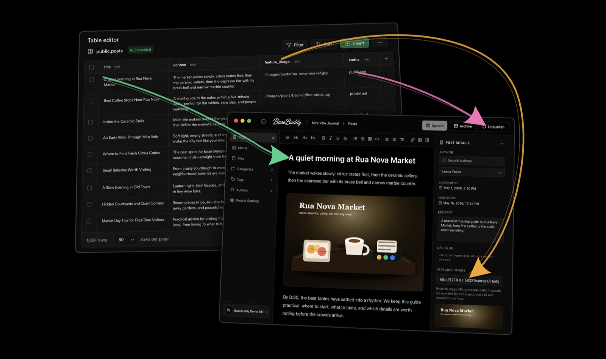
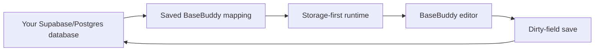
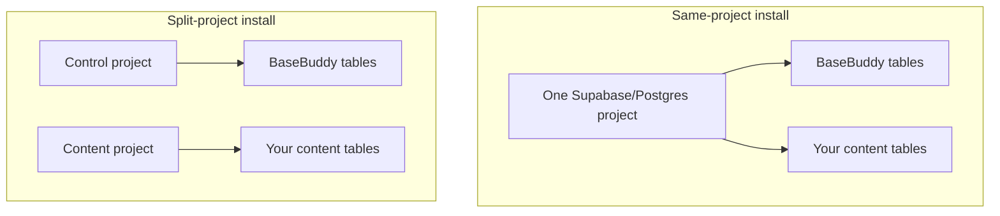

<p align="center">
  
</p>

<h1 align="center">Open-Source CMS That Speaks Supabase Natively</h1>

<p align="center">
  BaseBuddy is a self-hosted editor for existing Supabase and Postgres databases.
  It works with the tables you already have, then turns saved mappings into a clean editor for your team.
</p>

<p align="center">
  <a href="./INSTALL.md">Install</a>
  ·
  <a href="./docs/README.md">Docs</a>
  ·
  <a href="./SUPPORT.md">Support</a>
  ·
  <a href="./LICENSE.md">License</a>
  ·
  <a href="./SECURITY.md">Security</a>
</p>



## What BaseBuddy Is

BaseBuddy is for teams that already have content in Postgres or Supabase and want a real editor without rebuilding their database around a CMS.

You install BaseBuddy, connect it to your database, map your existing tables and fields, and start editing. The saved mapping is the source of truth. Your database stays yours.

BaseBuddy is especially useful when you want:

- a clean editor for existing posts, pages, docs, guides, or content tables;
- a minimal TipTap editor that can work with Markdown and HTML storage formats;
- media and file management through Supabase Storage or S3-compatible buckets;
- SEO fields, redirects, slugs, authors, categories, tags, and publishing workflows;
- role-based and user-specific permissions;
- an admin UI that respects the shape of your current schema.

## What BaseBuddy Does Not Do

BaseBuddy is careful around your production database.

- It does not rename your tables.
- It does not reshape your schema during normal editing.
- It does not store per-project database credentials in project rows.
- It does not silently publish, unpublish, or archive content when you click Save.
- It does not rewrite unchanged fields just because a post was opened.
- It does not coerce Markdown into HTML, HTML into Markdown, arrays into strings, or one storage shape into another on normal save.

`Save` writes dirty fields only. `Publish`, `Unpublish`, and `Archive` are explicit actions.

## How It Works



BaseBuddy separates three ideas:

- **Storage contract**: where a value lives, what shape it has, whether it is editable, and how it should be patched.
- **Semantic role**: optional meaning like title, content, slug, status, author, category, tags, or featured image.
- **UI**: the editor control selected from the storage contract, then refined by semantic role.

It also keeps the **control plane** and **content plane** separate in the runtime model. The control plane stores BaseBuddy projects, members, roles, invitations, mappings, and sessions. The content plane is your existing database schema and storage buckets.

That is why BaseBuddy can support flexible schemas without pretending every database looks like the same CMS template.

## Quick Start

You need:

- Node.js 22 recommended;
- `pnpm@10.32.1`;
- a Supabase/Postgres project for BaseBuddy setup data;
- a Supabase/Postgres database or schema with content you want to edit.

Clone and install:

```sh
git clone git@github.com:basebuddy-cms/basebuddy.git
cd basebuddy
pnpm install
pnpm dev
```

The dev server runs on:

```text
http://localhost:8080
```

Open onboarding:

```text
http://localhost:8080/onboarding
```

The onboarding page is designed to work before `.env` exists. It helps you choose an install shape, copy the right env values, apply the BaseBuddy migration, configure Supabase Auth, and verify that the install is ready.

## Install Shape

BaseBuddy supports two common setups.



Use a **same-project install** when you want the simplest setup.

Use a **split-project install** when you want BaseBuddy's control tables separate from the database that stores your content.

The generated env values come from `/onboarding`, but the examples are here:

- [`.env.example`](./.env.example)
- [`.env.same-project.example`](./.env.same-project.example)
- [`.env.split-project.example`](./.env.split-project.example)
- [`.env.playwright.example`](./.env.playwright.example)

After editing `.env`, restart the app so Next.js picks up the new values.

## Apply The Migration

BaseBuddy needs its own control-plane tables for projects, members, roles, invitations, mappings, and edit sessions.

Apply the baseline migration to the BaseBuddy control database:

```sh
psql "$BASEBUDDY_DATABASE_URL" -v ON_ERROR_STOP=1 -f supabase/migrations/20260420130000_basebuddy_self_host_baseline.sql
```

For split-project installs, apply it to `BASEBUDDY_CONTROL_DATABASE_URL` instead.

You can also paste the SQL into the Supabase SQL editor.

## First Project

Once setup is ready:

1. Sign in.
2. Open `/projects`.
3. Create a project.
4. Open the project editor.
5. Map Posts first.
6. Map authors, categories, tags, media, files, SEO fields, redirects, and workflow fields as needed.
7. Save the mapping.
8. Start editing content.

Auto-detection can help, but manual mapping is always available. If BaseBuddy cannot safely infer a field, it keeps the field read-only or unsupported instead of guessing.

## Production

Build and start:

```sh
pnpm build
pnpm start
```

`pnpm start` serves the app on port `8080`.

Before exposing BaseBuddy publicly:

- configure Supabase Auth redirect URLs;
- run the setup checker;
- put the app behind HTTPS;
- set request body limits that match your upload policy;
- use a shared upstream rate limiter if you run multiple app instances.

Useful checks:

```sh
pnpm setup:check
pnpm build
pnpm test
```

For browser tests, copy `.env.playwright.example` to `.env.playwright`, fill in test credentials, then run:

```sh
pnpm test:e2e
```

## Documentation

Start with:

- [Install guide](./INSTALL.md)
- [Configuration](./docs/configuration.md)
- [Onboarding](./docs/onboarding.md)
- [Projects and mapping](./docs/projects-and-mapping.md)
- [Permissions](./docs/permissions.md)
- [Storage and media](./docs/storage-and-media.md)
- [Storage UI matrix](./docs/storage-ui-matrix.md)
- [Caps and rate limits](./docs/caps-and-rate-limits.md)
- [Deployment](./docs/deployment.md)
- [Troubleshooting](./docs/troubleshooting.md)

## Contributing

Contributions are welcome. Please read [CONTRIBUTING.md](./CONTRIBUTING.md) before opening a pull request.

If you are changing mapping behavior, runtime storage semantics, permissions, setup env assumptions, or route ownership, update the relevant docs and tests in the same change.

## License

BaseBuddy is licensed under AGPL-3.0-or-later. See [LICENSE.md](./LICENSE.md).

If you modify BaseBuddy and let users interact with it over a network, the AGPL requires that those users can receive the corresponding source code for your modified version.
