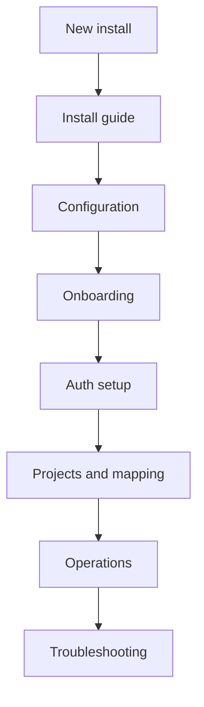

# BaseBuddy Documentation

Everything you need to install, configure, operate, and contribute to BaseBuddy.

**First time here?** Start with [Getting Started](./getting-started.md).  
**Setting up production?** Go to [Deployment](./deployment.md).  
**Stuck?** Open [Troubleshooting](./troubleshooting.md).

## Documentation Map

```text
docs/
├── getting-started.md
├── configuration.md
├── onboarding.md
├── deployment.md
├── auth.md
├── projects-and-mapping.md
├── storage-ui-matrix.md
├── storage-and-media.md
├── permissions.md
├── caps-and-rate-limits.md
├── operations.md
├── troubleshooting.md
├── testing.md
├── architecture.md
└── contributing.md
```

## Recommended Path



- [Getting started](./getting-started.md): clone, install, start, and open onboarding.
- [Configuration](./configuration.md): environment variables, same-project and split-project setups.
- [Onboarding](./onboarding.md): first-run setup, diagnostics, and readiness behavior.
- [Auth](./auth.md): Supabase Auth providers and redirect URLs.
- [Projects and mapping](./projects-and-mapping.md): how BaseBuddy maps existing tables.

## Operating BaseBuddy

- [Deployment](./deployment.md): production hosting, HTTPS, proxies, and deployment checks.
- [Storage and media](./storage-and-media.md): mapped media/files, uploads, and storage credentials.
- [Permissions](./permissions.md): roles, member management, and author scopes.
- [Operations](./operations.md): upgrades, backups, migrations, and rollback.
- [Troubleshooting](./troubleshooting.md): common failures and safe diagnostics.

## Reference

- [Storage UI matrix](./storage-ui-matrix.md): supported storage shapes and UI controls.
- [Caps and rate limits](./caps-and-rate-limits.md): upload caps, route limits, and large-database expectations.
- [Testing](./testing.md): local, browser, schema-zoo, and large-load verification.
- [Architecture](./architecture.md): high-level app model and source layout.

## Contributing

- [Contributing](./contributing.md): development workflow and PR expectations.

## Core Guarantees

- BaseBuddy edits existing schemas through a saved mapping.
- Install credentials are environment variables, not project rows.
- Normal save writes dirty mapped fields only.
- Publish, unpublish, and archive are explicit actions.
- Unsupported shapes become read-only or unsupported instead of being guessed.
- Manual mapping remains available when auto-detection is not enough.

## License

BaseBuddy is licensed under AGPL-3.0-or-later. See [LICENSE.md](../LICENSE.md).
