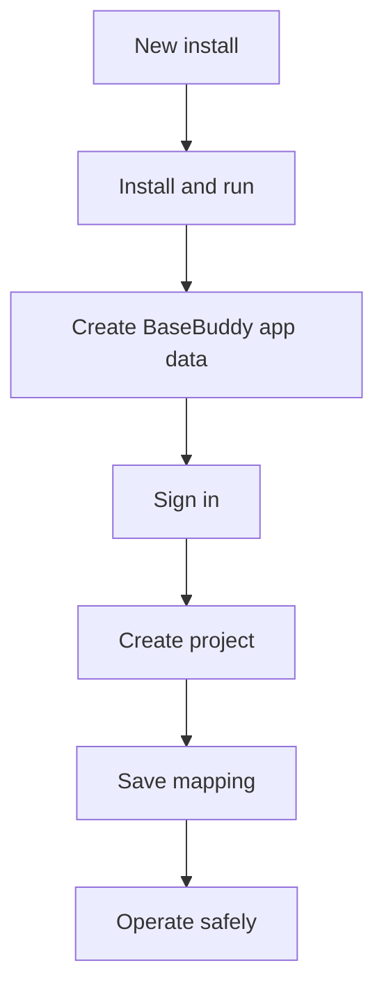

# BaseBuddy Documentation

Everything you need to install, configure, operate, and contribute to BaseBuddy.

Start with [Getting Started](./getting-started.md), then [Onboarding](./onboarding.md), then [Projects and Mapping](./projects-and-mapping.md). Operators and agents should use [Agent CLI Setup](./agent-cli-setup.md) and the [CLI](./cli.md) for config-backed setup, schema inspection, mapping drafts, project administration, permissions, sidebar layout, and storage metadata.

## Recommended Path



## Agent Setup Path

Agents should start with:

```sh
pnpm basebuddy agent:setup --json
```

For mapping work, prefer this route:

```sh
pnpm basebuddy schema:inspect --schema public --json
pnpm basebuddy mapping:draft --schema public --table posts --json
pnpm basebuddy mapping:explain --input mapping.json --json
pnpm basebuddy mapping:set --project docs --input mapping.json --binding-status ready --json
```

Use CLI output and the live schema before reading source files. Direct config edits are for emergency repair only.

## Core Guarantees

- BaseBuddy edits existing schemas through a saved mapping.
- App state lives in the selected app-data backend. The default is `process.cwd()/basebuddy-data/basebuddy.config.json`.
- Normal save writes dirty mapped fields only.
- Publish, unpublish, and archive are explicit actions.
- Unsupported shapes become read-only or unsupported.
- Manual mapping remains available when auto-detection is not enough.
