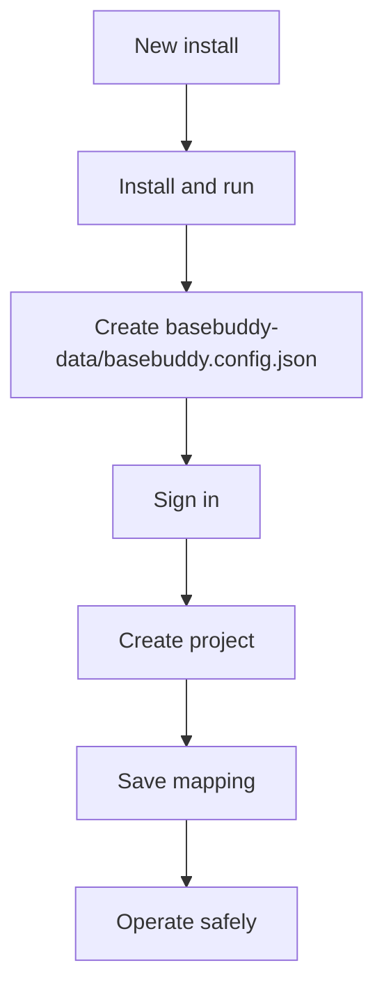

# BaseBuddy Documentation

Everything you need to install, configure, operate, and contribute to BaseBuddy.

Start with [Getting Started](./getting-started.md), then [Onboarding](./onboarding.md), then [Projects and Mapping](./projects-and-mapping.md). Operators and agents can use the [CLI](./cli.md) for config-backed setup and project administration.

## Recommended Path

## Core Guarantees

- BaseBuddy edits existing schemas through a saved mapping.
- App state lives in `process.cwd()/basebuddy-data/basebuddy.config.json`.
- Normal save writes dirty mapped fields only.
- Publish, unpublish, and archive are explicit actions.
- Unsupported shapes become read-only or unsupported.
- Manual mapping remains available when auto-detection is not enough.
