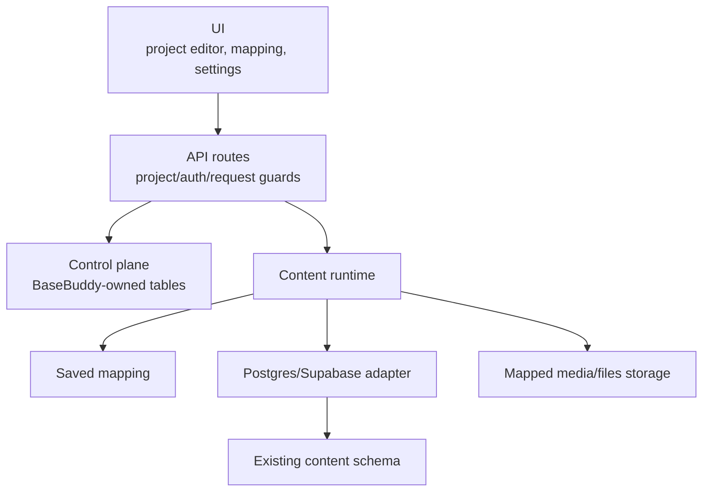

# Architecture

BaseBuddy is a Next.js app with a storage-first content runtime.

## Runtime Layers



## Source Layout

```text
src/
├── app/                         # Next.js pages and API routes
├── components/                  # editor, projects, account, and UI components
├── hooks/                       # client hooks
├── lib/
│   ├── api/                     # auth, setup, request guards
│   ├── control-plane/           # projects, members, roles, invitations
│   ├── content-runtime/         # mapped content orchestration
│   ├── content-runtime/adapter/ # adapter contracts and compiler
│   ├── self-host/               # install env and setup checks
│   ├── security/                # headers, rate limits, upload validation
│   └── supabase/                # Supabase clients and auth helpers
└── test/                        # Vitest suites
```

## Control Plane

The control plane stores BaseBuddy application state:

- profiles;
- projects;
- project members and roles;
- member invitations;
- member permission overrides;
- saved content mappings;
- edit sessions;
- setup readiness state.

The baseline control-plane schema is installed by:

```text
supabase/migrations/20260420130000_basebuddy_self_host_baseline.sql
```

## Content Runtime

The content runtime reads the saved mapping, compiles it into adapter instructions, and delegates reads/writes to the Postgres/Supabase adapter.

The mapping is the runtime source of truth. BaseBuddy does not infer a different write shape during normal editing.

## Request Guards

API routes enforce:

- authentication;
- project access;
- setup readiness where needed;
- same-origin checks for cookie-backed state-changing requests;
- JSON/body size limits;
- process-local fixed-window rate limits.

## Security Headers

Security headers are produced by `src/lib/security/headers.ts` and applied through Next config and middleware.
