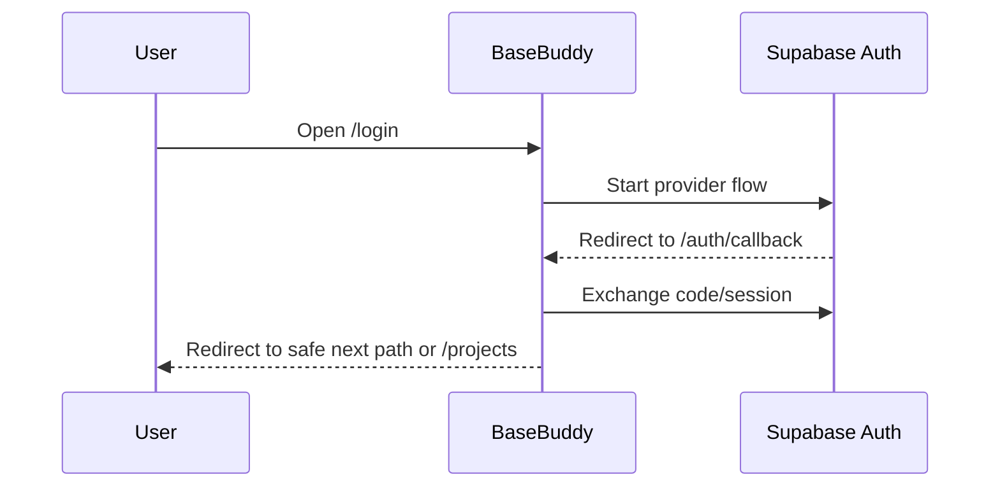

# Auth

BaseBuddy uses Supabase Auth from the control-plane Supabase project.

## Supported Providers

`BASEBUDDY_AUTH_PROVIDERS` accepts these values:

- `password`
- `magic_link`
- `google`
- `github`

Example:

```sh
BASEBUDDY_AUTH_PROVIDERS=password,magic_link,google
```

If omitted, all supported providers are shown.

## Redirect URLs

Add these in the Supabase Auth settings for the control-plane project:

```text
http://localhost:8080/auth/callback
<production-url>/auth/callback
<production-url>/invite/*
```

When deploying first to a temporary Vercel URL, add:

```text
https://your-app.vercel.app/auth/callback
```

## Auth Flow



## Safe Redirects

BaseBuddy ignores unsafe external `next` values. Signed-in users are redirected to a safe internal path or `/projects`.

## Incomplete Setup

When setup is incomplete, protected routes redirect to `/onboarding` before normal app session reads. This keeps first-run setup reachable even before the install is ready.

## Test Auth

The Playwright test-auth route is for local automated tests only. It should be unavailable unless the test-auth and Playwright runtime env flags are enabled.
