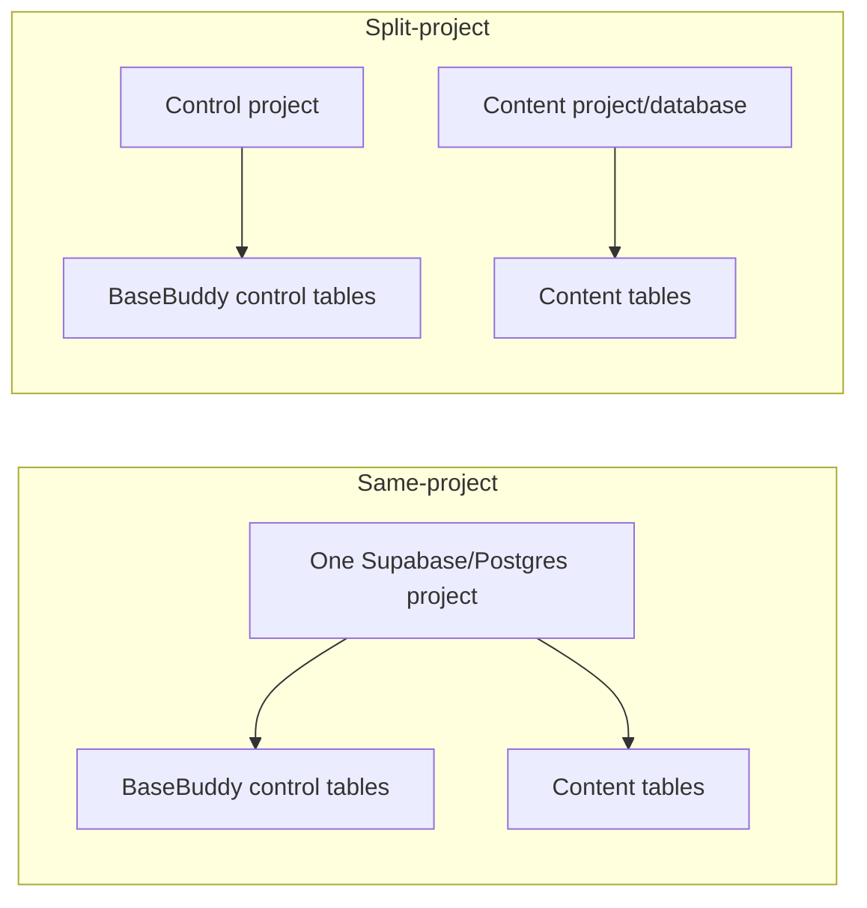

# Configuration

BaseBuddy uses environment variables for install-level configuration. Project records store mappings and project state, not database passwords, Supabase service keys, or S3 secrets.

## Topologies

BaseBuddy supports two env shapes.



Do not mix same-project and split-project env names. The app rejects mixed configuration to prevent accidental cross-project reads or writes.

## Same-Project Env

Use this when one Supabase/Postgres project contains both BaseBuddy control data and editable content.

```sh
BASEBUDDY_SUPABASE_URL=https://your-project-ref.supabase.co
BASEBUDDY_SUPABASE_PUBLISHABLE_KEY=your-publishable-key
BASEBUDDY_SUPABASE_SECRET_KEY=your-secret-key
BASEBUDDY_DATABASE_URL=postgresql://...
BASEBUDDY_AUTH_PROVIDERS=password,magic_link,google,github
```

## Split-Project Env

Use this when BaseBuddy control data and content data live in separate projects or databases.

```sh
BASEBUDDY_CONTROL_SUPABASE_URL=https://your-control-project-ref.supabase.co
BASEBUDDY_CONTROL_SUPABASE_PUBLISHABLE_KEY=your-control-publishable-key
BASEBUDDY_CONTROL_SUPABASE_SECRET_KEY=your-control-secret-key
BASEBUDDY_CONTROL_DATABASE_URL=postgresql://...

BASEBUDDY_CONTENT_SUPABASE_URL=https://your-content-project-ref.supabase.co
BASEBUDDY_CONTENT_SUPABASE_PUBLISHABLE_KEY=your-content-publishable-key
BASEBUDDY_CONTENT_SUPABASE_SECRET_KEY=your-content-secret-key
BASEBUDDY_CONTENT_DATABASE_URL=postgresql://...

BASEBUDDY_AUTH_PROVIDERS=password,magic_link,google,github
```

## Runtime Topology Override

Normally BaseBuddy infers topology from the env values. You can set:

```sh
BASEBUDDY_RUNTIME_TOPOLOGY=unified
```

or:

```sh
BASEBUDDY_RUNTIME_TOPOLOGY=split
```

Only use this when you know the inferred topology is not enough for your deployment.

## Auth Providers

Supported values:

- `password`
- `magic_link`
- `google`
- `github`

Comma-separate enabled providers:

```sh
BASEBUDDY_AUTH_PROVIDERS=password,magic_link,google
```

If the variable is omitted, BaseBuddy enables all supported provider buttons.

## Site Indexing

BaseBuddy defaults to noindex headers and robots rules.

To allow indexing:

```sh
NEXT_PUBLIC_SITE_INDEXABLE=true
```

Most self-host admin installs should keep indexing disabled.

## Branding

```sh
NEXT_PUBLIC_BASEBUDDY_APP_NAME=BaseBuddy
NEXT_PUBLIC_BASEBUDDY_DOCS_URL=https://docs.example.com
NEXT_PUBLIC_BASEBUDDY_SUPPORT_URL=https://support.example.com
```

`NEXT_PUBLIC_BASEBUDDY_APP_NAME` changes the app name shown in the UI and metadata.

`NEXT_PUBLIC_BASEBUDDY_DOCS_URL` and `NEXT_PUBLIC_BASEBUDDY_SUPPORT_URL` let a self-host install point users to the right documentation and support destination for that deployment. Leave them unset to use the built-in defaults.

Set these before building the app so the public Next.js env values are available to the browser bundle.

## Session Pooler TLS

Hosted Supabase pooler connections often work without a certificate file. If your environment requires strict root certificate verification, configure a certificate file:

```sh
BASEBUDDY_CONTROL_SESSION_POOLER_ROOT_CERTIFICATE_FILE=./certs/control-session-pooler-root.pem
BASEBUDDY_CONTENT_SESSION_POOLER_ROOT_CERTIFICATE_FILE=./certs/content-session-pooler-root.pem
```

For local Supabase, add `?sslmode=disable` to the database URL.

## S3-Compatible Storage

Shared credentials:

```sh
BASEBUDDY_S3_ACCESS_KEY_ID=
BASEBUDDY_S3_SECRET_ACCESS_KEY=
```

Separate media/files credentials:

```sh
BASEBUDDY_MEDIA_S3_ACCESS_KEY_ID=
BASEBUDDY_MEDIA_S3_SECRET_ACCESS_KEY=
BASEBUDDY_FILES_S3_ACCESS_KEY_ID=
BASEBUDDY_FILES_S3_SECRET_ACCESS_KEY=
```

Credential pairs must be complete. Setting only an access key or only a secret key is treated as invalid.

## Verification

```sh
pnpm setup:check
```

The checker prints redacted values only. Database passwords, service-role keys, certificates, and S3 secrets are never printed in full.
