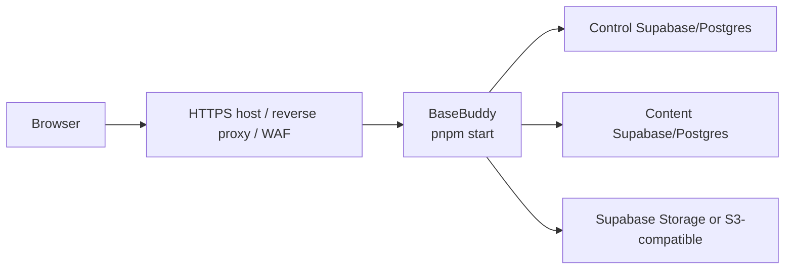

# Deployment

BaseBuddy is a Next.js app that runs with `pnpm build` and `pnpm start`.

## Build And Start

```sh
pnpm install --frozen-lockfile
pnpm build
pnpm start
```

The production server runs on port `8080`.

## Recommended Production Shape



## Host Responsibilities

BaseBuddy includes app-level request guards and process-local rate limits. Public deployments should still use host-level controls.

Your host or proxy should:

- terminate HTTPS;
- strip or overwrite client-supplied `x-forwarded-*` headers;
- forward the public host and protocol correctly;
- enforce request body limits that match upload caps;
- provide shared rate limits for multi-instance deployments;
- collect server logs;
- run health checks or uptime checks.

## Security Headers

Production responses include:

- `X-Frame-Options: DENY`
- `X-Content-Type-Options: nosniff`
- `Referrer-Policy: strict-origin-when-cross-origin`
- `Permissions-Policy`
- `Strict-Transport-Security`
- `X-Robots-Tag` unless indexing is enabled

The app also builds a Content Security Policy with a nonce in middleware.

Confirm HTTPS is correct before exposing the final production domain, because HSTS tells browsers to remember HTTPS-only behavior.

## Env Handling

Configure env values through the deployment platform. Do not commit `.env`, certificates, database URLs, service-role keys, or S3 secrets.

If deploying to Vercel, remember to add the deployed callback URL to Supabase Auth:

```text
https://your-app.vercel.app/auth/callback
```

## Deployment Checklist

- [ ] Env values configured in the host.
- [ ] Baseline migration applied to the control-plane database.
- [ ] Supabase Auth Site URL set to the deployed app URL.
- [ ] Supabase Auth redirect URLs include `/auth/callback` and `/invite/*`.
- [ ] HTTPS enabled.
- [ ] Proxy strips untrusted forwarded headers.
- [ ] Request body limits configured.
- [ ] Backups configured for the control-plane database.
- [ ] `pnpm setup:check` passes.
- [ ] `pnpm build` passes.
