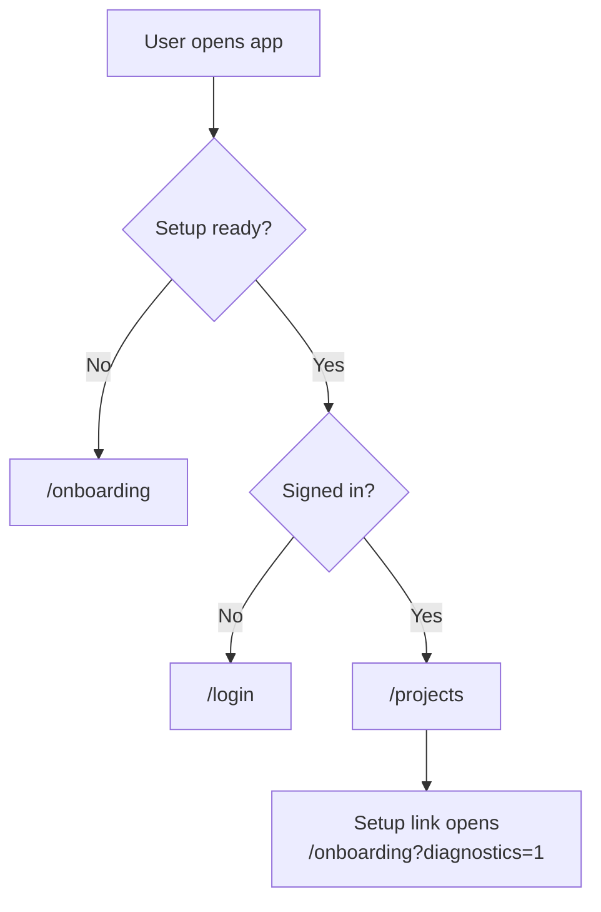

# Onboarding

`/onboarding` is the first-run setup guide and the ongoing setup diagnostics page.

It is designed to render even when `.env` is missing. That lets a fresh clone explain what is needed before the app is fully configured.

## What Onboarding Does

- Explains same-project and split-project install shapes.
- Shows the exact env block for the selected topology.
- Includes the baseline setup SQL.
- Explains Supabase Auth providers and redirect URLs.
- Checks setup readiness.
- Redacts secrets and fingerprints sensitive values.
- Stays available after setup at `/onboarding?diagnostics=1`.

## Readiness Flow



## What Gets Checked

Onboarding and `pnpm setup:check` validate:

- env mode: missing, same-project, split-project, or invalid mixed mode;
- required Supabase URLs, publishable keys, secret keys, and database URLs;
- control-plane schema readiness;
- required private schema, tables, roles, permissions, and RPCs;
- inferred topology: unified or split;
- content-plane reachability when credentials are available;
- storage credential completeness.

## Redaction

Sensitive values are never shown in full. The diagnostics UI redacts:

- database passwords;
- Supabase secret keys;
- S3-compatible credentials;
- certificate values;
- unknown secret-like values.

Database URLs are shown with username and password replaced where possible.

## Setup SQL

The baseline migration lives at:

```text
supabase/migrations/20260420130000_basebuddy_self_host_baseline.sql
```

Apply it to the control-plane database. For same-project installs, that is the same database as your content schema. For split-project installs, apply it only to the control project.

BaseBuddy does not apply the migration automatically.

## After Setup

When setup is ready:

1. Sign in.
2. Open `/projects`.
3. Create a project.
4. Map your content schema.

Use `/onboarding?diagnostics=1` later when checking a deployment or debugging setup.
