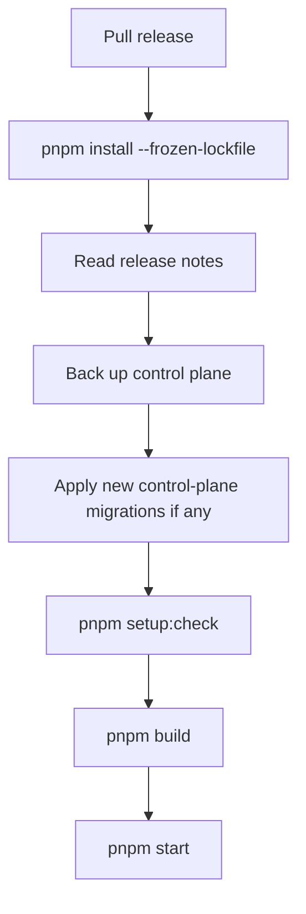

# Operations

This page covers recurring maintenance tasks for a self-hosted BaseBuddy install.

## Setup Check

Run:

```sh
pnpm setup:check
```

Use it after env changes, deployments, migrations, and upgrades.

## Backups

Back up the control-plane database before upgrades. The control plane stores:

- projects;
- members and roles;
- invitations;
- saved mappings;
- edit sessions;
- profile state;
- setup readiness markers.

Content-plane backup responsibility stays with the owner of the content database. BaseBuddy does not own or reshape content tables.

## Upgrade Flow



## Rollback

Keep a known-good release tag or commit. If an upgrade fails:

1. Stop the app.
2. Restore the previous release.
3. Restore the control-plane database backup if a migration changed schema in a non-backward-compatible way.
4. Run `pnpm setup:check`.
5. Start the app.

## Logs

Server logs should be captured by the host. Logs should contain enough route/request context to debug issues, but should not include secrets, full database URLs, service keys, certificates, or private content.

## Health Checks

At minimum, monitor:

- app process uptime;
- `/onboarding?diagnostics=1` for setup review by an authenticated owner;
- `pnpm setup:check` during release verification;
- database reachability;
- Supabase Auth callback behavior.

## Production Checklist

- [ ] Env configured by host, not committed.
- [ ] Control-plane migration applied.
- [ ] Supabase Auth redirect URLs configured.
- [ ] HTTPS and HSTS verified.
- [ ] Reverse proxy/WAF body limits configured.
- [ ] Shared rate limits configured for multi-instance deployments.
- [ ] Control-plane backups enabled.
- [ ] Rollback path documented.
