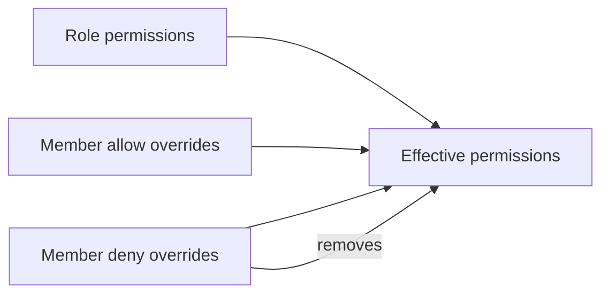

# Permissions

BaseBuddy permissions are project-scoped. Roles grant inherited permissions, and owners/admins can manage members according to their own permissions.

## Default Roles

| Role | Default access |
| --- | --- |
| Owner | Full project, member, content, publish, mapping, and delete access |
| Admin | Project update, member management, author scope management, all content, publish, and mapping access |
| Editor | Read/write/publish all content |
| Author | Read/write/publish assigned authored content |
| Viewer | Read all content |

## Permission Categories

| Category | Examples |
| --- | --- |
| Project | read, update, delete |
| Member | read, invite, manage |
| Author | manage author scopes |
| Content | read all, read authored, write all, write authored, publish all, publish authored |
| Mapping | read mapping, update mapping |

## Effective Permissions

Inherited role permissions are combined with explicit allow overrides. Explicit deny overrides remove permissions from the effective set.

## Owner Boundaries

Owners can change owner members and grant or remove delete permission. Non-owner admins can manage members below owner where allowed, but they cannot change owner-member access.

## Author Scopes

Author role members can be scoped to specific mapped author identities. Author scopes determine which authored content a member can read, edit, and publish when using authored permissions.

## Invitations

Project invitations honor the creator's role ceiling. Revoked, expired, malformed, cross-project, and already-used invitations should fail safely.
