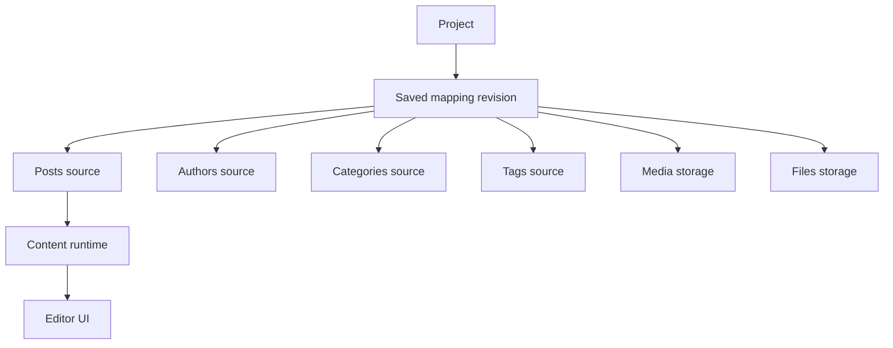
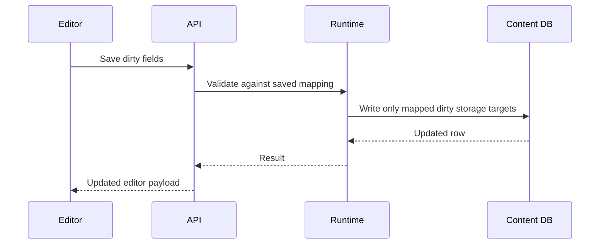

# Projects And Mapping

A BaseBuddy project maps one existing content schema into the editor. The saved mapping is the runtime source of truth.

## Mapping Model



## Storage-First Runtime

Every mapped field has a storage contract:

- source table or path;
- storage primitive;
- value kind;
- single value or list;
- nullable or required;
- editable, coercible, read-only, or unsupported;
- patch mode;
- optional semantic role.

Semantic roles such as `title`, `slug`, `status`, `publishedAt`, `author`, `categories`, and `tags` refine the UI. They do not replace the storage contract.

## Manual Mapping

Auto-detection may suggest a mapping, but manual mapping is the fallback. If BaseBuddy cannot safely infer a shape, the user can still choose tables, columns, relation strategies, workflow fields, media, and files.

## Agent And CLI Mapping

Agents and operators should use the CLI before reading source files:

```sh
pnpm basebuddy agent:setup --json
pnpm basebuddy schema:inspect --schema public --json
pnpm basebuddy mapping:draft --schema public --table posts --json
pnpm basebuddy mapping:explain --input mapping.json --json
pnpm basebuddy mapping:set --project docs --input mapping.json --binding-status ready --json
```

Use `schema:inspect` to learn the user's actual tables, columns, keys, enums, and sample rows. Use `mapping:draft` to create valid mapping JSON. Use `mapping:explain` before saving the mapping.

For custom schemas, pass a hints file to `mapping:draft`. See [Agent CLI Setup](./agent-cli-setup.md) and [CLI](./cli.md).

## Save Behavior

Normal save writes dirty mapped fields only.



Normal save does not publish, unpublish, archive, reshape columns, or migrate tables.

## Workflow Actions

`Publish`, `Unpublish`, and `Archive` are explicit actions. The toolbar shows actions that make sense for the current mapped workflow state and current user permissions.

Workflow modes include:

- status values;
- published flag;
- published timestamp;
- status plus flag;
- custom values.

## Unsupported Shapes

If a mapping is unsafe or incomplete, the field should become read-only or unsupported. This is intentional. BaseBuddy avoids implicit coercion between storage shapes because the content schema belongs to the user.

## Content Entities

BaseBuddy can map:

- posts;
- authors;
- categories;
- tags;
- media;
- files;
- custom scalar fields;
- custom relation fields.
