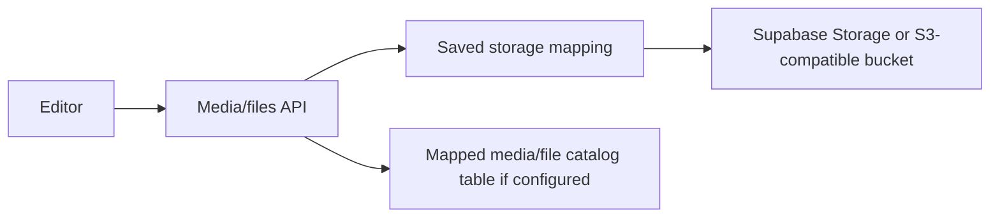

# Storage And Media

BaseBuddy can map media and files to Supabase Storage or S3-compatible storage.

## Storage Providers

Mapped media and files support:

- no storage mapping;
- Supabase bucket;
- S3-compatible bucket.

Storage credentials are environment variables. They are not stored in project rows.

## Media And Files Flow

## Upload Limits

| Area | Limit |
| --- | --- |
| Avatar image | 5 MB |
| Media image | 10 MB per image |
| File library file | 25 MB per file |
| Media batch | 10 images |
| File batch | 10 files |
| Media request body | 60 MB |
| File request body | 130 MB |
| Profile upload request body | 6 MB |

Host-level request body limits should be configured to match or exceed the limits you want to support.

## Allowed Media Image Types

Media uploads accept:

- AVIF;
- GIF;
- JPEG/JPG;
- PNG;
- WebP.

SVG uploads are blocked.

## Allowed File Types

File uploads accept:

- `csv`
- `doc`
- `docx`
- `gz`
- `json`
- `md`
- `pdf`
- `ppt`
- `pptx`
- `rtf`
- `tar`
- `txt`
- `xls`
- `xlsx`
- `xml`
- `zip`

Image files belong in the media library and are rejected from the file library.

## Folder Browsing

Media and file libraries use path-bounded reads. Folder pages fetch a bounded page of records and a bounded folder list. They do not need to list an entire bucket for normal browsing.

Current library page size is 250 objects, with folder option reads capped at 200 folders.

## Private URLs

BaseBuddy resolves media/file URLs through the configured storage mapping. Supabase or S3-compatible signed URLs may expire. The library payload includes expiration information when signed URLs are used.
