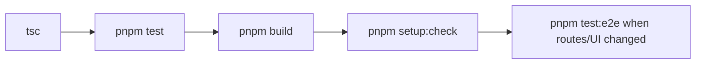

# Testing

BaseBuddy includes unit, integration, browser, setup, schema-zoo, and large-load checks.

## Core Checks

```sh
pnpm exec tsc --noEmit
pnpm test
pnpm build
pnpm setup:check
```

## Browser Tests

Playwright uses `.env.playwright` and port `3100`.

```sh
pnpm test:e2e
```

Useful variants:

```sh
pnpm test:e2e:headed
pnpm test:e2e:ui
```

## Performance Reports

```sh
pnpm run perf:budgets
pnpm run perf:bundles
```

## Schema-Zoo Smoke

The schema-zoo scripts seed varied database schemas and verify app behavior across direct columns, JSON paths, array indexes, helper rows, value-match relations, join-table relations, read-only views, media, and files.

```sh
BASEBUDDY_SCHEMA_ZOO_RUN_KEY=local-zoo node --import tsx ./scripts/smoke-schema-zoo.ts
PLAYWRIGHT_BASE_URL=http://localhost:3100 BASEBUDDY_SCHEMA_ZOO_RUN_KEY=local-zoo node --import tsx ./scripts/smoke-schema-zoo-app-verify.ts
```

## Large Database Harness

Seed:

```sh
pnpm run perf:seed-large -- --register-project
```

Measure API routes:

```sh
BASEBUDDY_LOAD_TEST_COOKIE="sb-...=..." \
BASEBUDDY_LOAD_TEST_PROJECT_ID="project-uuid" \
pnpm run perf:large-api
```

Run browser smoke:

```sh
BASEBUDDY_LOAD_TEST_PROJECT_ID="project-uuid" \
BASEBUDDY_LOAD_TEST_PROJECT_SLUG="bb-large-load-test" \
pnpm run perf:large-browser
```

The API timing harness warms routes before enforcing steady-state budgets. Use `--skip-warmup` only for cold-start investigations.

## Recommended PR Gate


